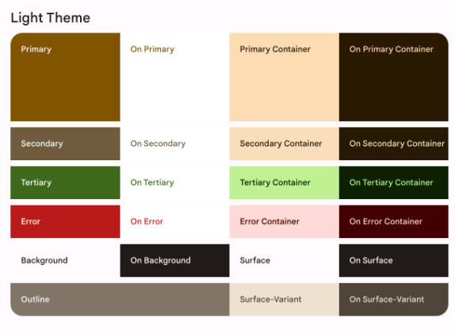
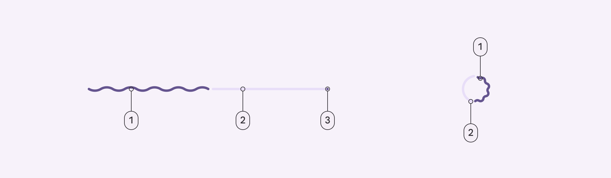

# Compose의 단계

Compose에는 크게 3개의 단계로 나눠집니다.

### Composition
표시할 UI로 Compose는 구성 가능한 함수를 실행하고 UI 설명을 만든다      

Compose 런타임은 @Composable 함수를 실행하고 UI를 나타내는 트리 구조를 출력한다

코드의 각 @Composable 함수는 UI 트리의 단일 레이아웃 노드에 Mapping된다

### Layout
UI를 배치할 위치로 측정과 배치라는 두 단계로 구성된다    
Layout 요소는 Layout 트리에 있는 각 노드의 Laout요소 및 모든 하위 요소를 2D 좌표로 측정하고 배치

Composition 단계에서 생성된 UI 트리를 사용하며, 각 Layout 노드는 2D 공간에서 크기와 위치를 결정하는 데 필요한 모든 정볼ㄹ 포함한다

+ 하위 요소 측정: 노드가 하위 요소를 측정
+ 자체 크기 결정: 이런 측정치를 기반으로 노드가 자체 크기를 결정
+ 하위 요소 배치: 각 하위 노드는 노드의 자체 위치를 기준으로 배치

> 이 단계 종료 시 각 레이아웃 노드는 할당된 width, height와 x, y 좌표를 얻는다

위와 같은 경우 과정은 다음과 같다
1. Row는 하위 요소인 Image 및 Column을 측정
2. Image가 측정 / 하위 요소가 없으므로 자체 크기를 결정하고 이를 Row에 다시 보고
3. 다음으로 Column이 측정되며, 먼저 자체 하위 요소를 측정
4. 첫 번째 Text가 측정된다. 하위 요소가 없기 때문에 자체 크기를 측정하고 Column에 다시 보고 (두번째 Text도 동일 반복)
5. Column은 하위 측정 값을 사용해 자체 크기를 결정한다. 최대 하위 요소 너비와 하위 요소의 높이 합계를 사용한다
6. Column은 하위 요소를 자신에 상대적으로 배치해 서로 아래에 배치
7. Row는 하위 측정 값을 사용해 자체 크기를 결정 / 최대 하위 요소 높이와 하위 요소 너비의 합계를 사용
8. 자식 배치

### Drawing
UI를 렌더링 하는 방법으로 UI 요소는 일반적으로 기기 화면인 캔버스에 그려진다

일반적으로는 단계의 순서가 동일하다     
> 여기서 BoxWithConstraints, LazyColumn, LazyRow는 중요한 예외로, 하위 요소의 컴포지션이 상위 요소의 Layout 단계에 따라 달라진다

Layout 단계의 예제를 동일하게 사용한다고 할 시
1. Row는 배경 색상과 같은 콘텐츠를 그림
2. Image가 자체적으로 그림
3. Column이 자체적으로 그림
4. 각 Text는 자체를 그립