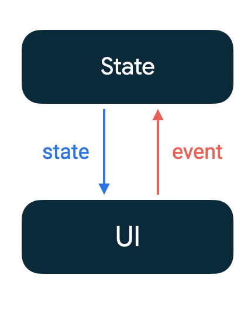

# Composable의 Context
안드로이드 Composable에서 context에 접근할 때에는 `CompositionLocal`로 공유되는 context에 접근하게 된다. 하지만 코드를 확인해보면 어디에도 `CompositionLocal`로 context를 주입하는 부분이 존재하지 않는다. 
> 어디에 있을까?

1. Activity의 `setContent()`
안드로이드 Composable을 사용할 때에는 XML의 Activity인 `AppCompatActivity()`가 아닌 `ComponentActivity()`를 상속받게 된다. 해당 Activity에서는 setContent로 Composable이 시작된다.

```kotlin
public fun ComponentActivity.setContent(
    parent: CompositionContext? = null,
    content: @Composable () -> Unit,
) { 
    val existingComposeView =
        window.decorView.findViewById<ViewGroup>(android.R.id.content).getChildAt(0) as? ComposeView

    if (existingComposeView != null)
        with(existingComposeView) {
            setParentCompositionContext(parent)
            setContent(content)
        }
    else
        ComposeView(this).apply {
            setParentCompositionContext(parent)
            setContent(content)
            // Set the view tree owners before setting the content view so that the inflation
            // process
            // and attach listeners will see them already present
            setOwners()
            setContentView(this, DefaultActivityContentLayoutParams)
        } 
}
```
이렇게 정의된 함수로 들어올 수 있다. 코드 중 else 분기를 확인해보면 기존 존재하는 Composable이 없다면 CompseView를 보여주도록 정의되어 있다.

2. ComposeView
```kotlin
class ComposeView
@JvmOverloads
constructor(context: Context, attrs: AttributeSet? = null, defStyleAttr: Int = 0) :
    AbstractComposeView(context, attrs, defStyleAttr)
```
`ComposeView`로 들어가보면 `AbstractComposeView`를 상속받고 있다. 그리고 이 때 context를 전달하고 있음을 확인할 수 있다.

3. AbstractComposeView.setContent
```kotlin
override fun onAttachedToWindow() {
    super.onAttachedToWindow()

    previousAttachedWindowToken = windowToken

    if (shouldCreateCompositionOnAttachedToWindow) {
        ensureCompositionCreated()
    }
}
```
`ComposeView`에서는 `onAttachedToWindow`에서 조건에 따라 분기하여 `ensureCompositionCreated()`를 호출한다. 이름 그대로 필요한 CompositionLocal을 생성한다. 

```kotlin
private fun ensureCompositionCreated() {
    if (composition == null) {
        try {
            creatingComposition = true
            composition = setContent(resolveParentCompositionContext()) { Content() }
        } finally {
            creatingComposition = false
        }
    }
}
```
함수 내에서 `AbstractComposeView.setContent()`를 호출하고 있다.

```kotlin
internal fun AbstractComposeView.setContent(
    parent: CompositionContext,
    content: @Composable () -> Unit,
): Composition {
    GlobalSnapshotManager.ensureStarted()
    val composeView =
        if (childCount > 0) {
            getChildAt(0) as? AndroidComposeView
        } else {
            removeAllViews()
            null
        }
            ?: AndroidComposeView(context, parent.effectCoroutineContext).also {
                addView(it.view, DefaultLayoutParams)
            }
    return doSetContent(composeView, parent, content)
}

private fun doSetContent(
    owner: AndroidComposeView,
    parent: CompositionContext,
    content: @Composable () -> Unit,
): Composition {
    if (isDebugInspectorInfoEnabled && owner.getTag(R.id.inspection_slot_table_set) == null) {
        owner.setTag(
            R.id.inspection_slot_table_set,
            Collections.newSetFromMap(WeakHashMap<CompositionData, Boolean>()),
        )
    }

    val wrapped =
        owner.view.getTag(R.id.wrapped_composition_tag) as? WrappedComposition
            ?: WrappedComposition(owner, Composition(UiApplier(owner.root), parent)).also {
                owner.view.setTag(R.id.wrapped_composition_tag, it)
            }
    wrapped.setContent(content)

    if (owner.coroutineContext != parent.effectCoroutineContext) {
        owner.coroutineContext = parent.effectCoroutineContext
    }

    owner.frameEndScheduler = FrameEndScheduler(parent::scheduleFrameEndCallback)
    return wrapped
}
```
함수를 확인해보면 `AbstractCompotView.setContent()` 함수는 결국 `doSetContent()`를 return하고 있다. 한 번 더 타고 들어가면 이는 결과적으로 `WrappedComposition`의 `setContent()` 호출로 마무리되는 것을 확인할 수 있다.

4. WrappedComposition의 setContent
```kotlin
override fun setContent(content: @Composable () -> Unit) {
    owner.setOnViewTreeOwnersAvailable {
        if (!disposed) {
            val lifecycle = it.lifecycleOwner.lifecycle
            lastContent = content
            if (addedToLifecycle == null) {
                addedToLifecycle = lifecycle
                lifecycle.addObserver(this)
            } else if (lifecycle.currentState.isAtLeast(Lifecycle.State.CREATED)) {
                original.setContent {
                    @Suppress("UNCHECKED_CAST")
                    val inspectionTable =
                        owner.getTag(R.id.inspection_slot_table_set)
                            as? MutableSet<CompositionData>
                            ?: (owner.parent as? View)?.getTag(R.id.inspection_slot_table_set)
                                as? MutableSet<CompositionData>
                    if (inspectionTable != null) {
                        inspectionTable.add(currentComposer.compositionData)
                        currentComposer.collectParameterInformation()
                    }

                    LaunchedEffect(owner) { owner.boundsUpdatesAccessibilityEventLoop() }
                    LaunchedEffect(owner) { owner.boundsUpdatesContentCaptureEventLoop() }

                    CompositionLocalProvider(LocalInspectionTables provides inspectionTable) {
                        ProvideAndroidCompositionLocals(owner, content)
                    }
                }
            }
        }
    }
}
```
해당 과정에서 최종적으로 `CompositionLocalProvider`를 통해 `ProviderAndroidCompositionLocals`를 주입해주고 있는 것을 확인할 수 있다.

5. ProviderAndroidCompositionLocals
```kotlin
@Composable
@OptIn(ExperimentalComposeUiApi::class)
internal fun ProvideAndroidCompositionLocals(
    owner: AndroidComposeView,
    content: @Composable () -> Unit,
) {
    val view = owner
    val context = view.context
    val uriHandler = remember { AndroidUriHandler(context) }
    val viewTreeOwners =
        owner.viewTreeOwners
            ?: throw IllegalStateException(
                "Called when the ViewTreeOwnersAvailability is not yet in Available state"
            )

    val saveableStateRegistry = remember {
        DisposableSaveableStateRegistry(view, viewTreeOwners.savedStateRegistryOwner)
    }
    DisposableEffect(Unit) { onDispose { saveableStateRegistry.dispose() } }

    val hapticFeedback = remember {
        if (HapticDefaults.isPremiumVibratorEnabled(context)) {
            DefaultHapticFeedback(owner.view)
        } else {
            NoHapticFeedback()
        }
    }

    val imageVectorCache = obtainImageVectorCache(context, owner.configuration)
    val resourceIdCache = obtainResourceIdCache(context)
    val scrollCaptureInProgress =
        LocalScrollCaptureInProgress.current or owner.scrollCaptureInProgress
    CompositionLocalProvider(
        LocalConfiguration provides owner.configuration,
        LocalContext provides context,
        LocalLifecycleOwner provides viewTreeOwners.lifecycleOwner,
        LocalSavedStateRegistryOwner provides viewTreeOwners.savedStateRegistryOwner,
        LocalSaveableStateRegistry provides saveableStateRegistry,
        LocalView provides owner.view,
        LocalImageVectorCache provides imageVectorCache,
        LocalResourceIdCache provides resourceIdCache,
        LocalProvidableScrollCaptureInProgress provides scrollCaptureInProgress,
        LocalHapticFeedback provides hapticFeedback,
    ) {
        ProvideCommonCompositionLocals(owner = owner, uriHandler = uriHandler, content = content)
    }
}
```
해당 코드에서 확인해보면 이제 context를 주입하고 있음을 확인할 수 있다. 

## 흐름 정리
맨 처음 `ComponentActivity`의 `setContent` 함수 내부 구현부에서 `ComposeView`에 context를 전달한다. `ComposeView`는 `AbstractComposeView`를 상속하고 있다. `AbstractComposeView`는 `setContent`를 호출한 후 attach 시점에 `AndroidComposeView`를 생성하여 이를 통해 Composition을 구성한다. 이 때 `AbstractCoposeView`에서 `AndroidComposeView`에 context를 전달한다. `setContent()`에서는 `AbstractComposeView.doSetContent()`를 호출하고 해당 함수 내부에서는 생성했던 `AndroidComposeView`를 전달받아 `WrappedComposition`을 생성한다. `WrappedComposition`에서는 `ProvideAndroidCompositionLocals`을 주입하게 된다. `ProvideAndroidCompositionLocals`에서는 여러 값들을 `CompositonLocal`로서 주입하는 데, 이 중 context는 아까 생성했던 `AndroidComposeView`의 context가 주입된다.  
결과적으로 `LocalContext`로 주입할 경우 해당 `setContent`를 호출하는 곳의 context를 가지고 활용할 수 있게 된다. 일반적으로는 `Activity`가 된다.

## 도식화
