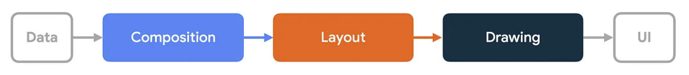

# Material Theme 색상

색상표

### primary
기본 색상은 앱의 화면과 구성 요소에서 가장 자주 표시되는 색상

### primaryVariant
기본 변형 색상은 기본 색상을 사용해 앱의 두 요소를 구벼랗는 데 사용

> 상단 앱 표시줄 및 시스템 표시줄

### secondary
보조 색상은 제품을 강조하고 구별하는 더 많은 방법을 제공한다        
> 플로팅 작업 버튼, 확인란 및 라디오 버튼과 같은 선택 컨트롤, 선택한 텍스트 강조 표시, 링크 및 헤드라인       

### secondaryVariant
보조 변형 색상은 보조 색상을 사용해 앱의 두 요소를 구별하는 데 사용한다

### background
배경색은 스크롤 가능한 콘텐츠 뒤에 보여진다

### surface
표면 색상은 카드, 시트 및 메뉴와 같은 구성 요소의 표면에 사용된다

### error
오류 색상은 테스트 필드와 같은 구성 요소 내의 오류를 나타내는 데 사용된다

### onPrimary
기본 색상 위에 표시되는 텍스트 및 아이콘에 사용되는 색상

### onSecondary
2차 색상 위에 표시되는 텍스트 및 아이콘에 사용되는 색상

### onBackground
배경색 위에 표시되는 텍스트 및 아이콘에 사용되는 색상

### onSurface
표면 색상 위에 표시되는 텍스트 및 아이콘에 사용되는 색상

### onError
오류 색상 위에 표시되는 텍스트 및 아이콘에 사용되는 색상