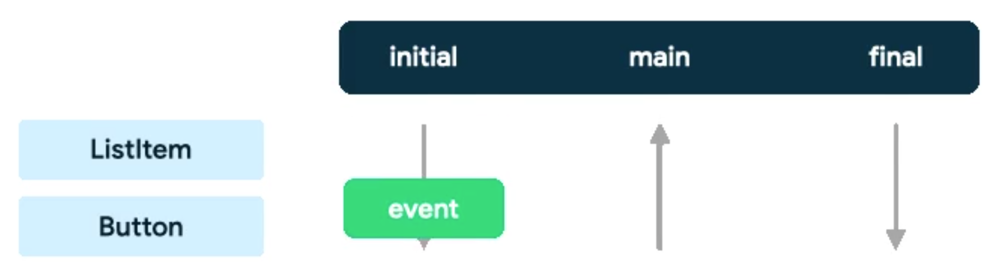

# PointerInput
Modifier의 확장함수 중 하나로, 여러 상호작용에 대한 처리를 위해 사용한다.       
`pointerInput` 확장 함수는 
```kotlin
fun Modifier.pointerInput(key1: Any?, block: PointerInputEventHandler): Modifier =
    this then SuspendPointerInputElement(key1 = key1, pointerInputEventHandler = block)
```
위와 같이 구성되어 있다.        

`SuspendPointerInputElement` 타입의 내부로 들어가보면 이 클래스는 `ModifierNodeElement<SuspendingPointerInputModifierNodeImpl>`을 상속받고 있다     

따라서 최종적으로 `SuspendingPointerInputModifierNodeImpl` 클래스로 들어가보면 `pointerInputJob`이라는 Job 객체를 보유하고 있다. 이는 `PointerEvent`에 따른 동작을 처리하기 위한 Job이다. `onPointEvent()` 함수를 확인해보면 null일 경우에 새로운 CoroutineScope의 launch 블록 내부에서 동작을 실행하고 이렇게 생성된 Job 객체를 `pointerInputJob`에 할당하는 것을 확인할 수 있다.      
또한 할당할 때 
```kotlin
private val pointerHandlersLock = makeSynchronizedObject(pointerHandlers)
``` 
lock을 활용해 해당 이벤트가 처리되는 동안 새로운 이벤트가 등록되거나 기존의 이벤트가 제거되지 않게 lock하는 작업이 포함되어 있다     

## pointer input 이벤트 처리 구조


> `ListItem`이 부모, `Button`은 자식

`ListItem`의 Initial -> `Button`의 Initial -> `Button`의 Main -> `Button`의 Main -> `ListItem`의 Final -> `Button`의 Final 순서로 이벤트를 처리하게 된다        
Initial은 이벤트를 관찰하는 것으로, 소비하는 것이 아닌 사전에 이벤트를 확인하는 것이다. Initial은 부모 -> 자식 방향으로 전파된다.       
Main은 이벤트를 실질적으로 소비하는 것으로, 최하위 자식이 먼저 소비하고 이후로 부모가 소비하게 된다.        
Final은 이벤트가 종료됨을 확인하는 것으로, 부모 -> 자식 방향으로 전파된다.

결과적으로 자식에서 `consume()` 한 후 로그를 찍어보면
```
CHILD Main received | consumed=false | position=Offset(275.0, 203.0)
✅ CHILD CONSUMES EVENT
PARENT Main received | consumed=true | position=Offset(590.0, 1062.0)
❌ PARENT IGNORES EVENT
```
위와 같이 자식에서 먼저 이벤트를 처리한 후에 부모에서는 소비된 이벤트이므로 무시하게 된다

<details>
<summary>참고 코드</summary>

```kotlin
Box(
    modifier = Modifier.fillMaxSize()
        .background(color = White)
        .pointerInput(Unit) {
            awaitPointerEventScope {
                while (true) {
                    val event = awaitPointerEvent(PointerEventPass.Main)
                    val change = event.changes.first()

                    Log.d(
                        "EVENT TEST",
                        "PARENT Main received | consumed=${change.isConsumed} | position=${change.position}"
                    )

                    if (!change.isConsumed) {
                        Log.d("EVENT TEST", "👉 PARENT HANDLES EVENT")
                    } else {
                        Log.d("EVENT TEST", "❌ PARENT IGNORES EVENT")
                    }
                }
            }
        },
    contentAlignment = Alignment.Center
) {
    Box(
        modifier = Modifier.size(150.dp)
            .background(color = Black)
            .clickable{ Log.d("EVENT TEST", "Clickable onClick") }
            .pointerInput(Unit) {
                awaitPointerEventScope {
                    while (true) {
                        val event = awaitPointerEvent(PointerEventPass.Main)
                        val change = event.changes.first()

                        Log.d(
                            "EVENT TEST",
                            "CHILD Main received | consumed=${change.isConsumed} | position=${change.position}"
                        )

                        // 🔥 핵심 실험 포인트
                        change.consume()

                        Log.d("EVENT TEST", "✅ CHILD CONSUMES EVENT")
                    }
                }
                detectDragGestures { _, _ -> Log.d("EVENT TEST","DRAG") }
            }
    )
}
```
</detials>

## 처리 가능 gesture 종류
+ `detectDragGestures`: DRAG 이벤트 감지
+ `detectTabGestures`: TAB 이벤트 감지
+ `detectVerticalDragGestures`: Vertical Drag 이벤트만 감지
+ `detectHorizontalDragGestures`: Horizontal Drag 이벤트만 감지
+ `detectTransformGestures`: 복합적인 이벤트 감지

이 때 `detectTransformGestures`를 사용하면 Tab을 제외한 나머지 gesture가 모두 해당 블록에서 감지되기 때문에 방향이 정해진 Drag 혹은 단순한 Drag만을 처리한다면 사용하는 것을 피해야 한다.       
그 외에 여러 복합적인 이벤트를 처리해야 할 때 사용하는 것이 적합하다