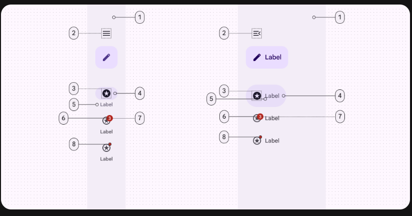

# Navigation Rail

말 그대로 rail 처럼 생긴 Component이다.

화면 한 쪽에 붙어 있으며, 3~7개의 destination을 가질 수 있다

[공식 문서](https://m3.material.io/components/navigation-rail/overview)

## Specs
### Types
+ Collapsed navigation rail: 축소된 rail
+ Expanded navigation rail: 더 넓은 rail
+ ~~Original navigation rail~~: Deprecated

### Configurations
Expanded layout
+ standard
+ modal

### Anatomy

1. Container
2. Menu (optional)
3. FAB or Extended FAB (optional)
4. Icon
5. Active indicator
6. Label text 
7. Large badge (optional)
8. Large badge label (optional)
9. Small badge (optional)