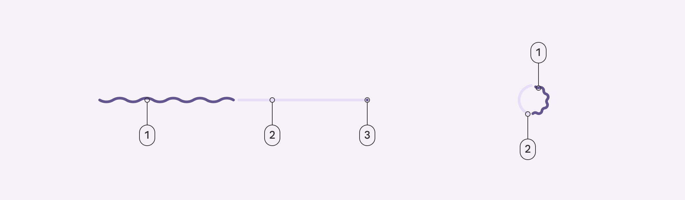

# Progress Indicator
진행도를 나타내는 컴포넌트

[공식 자료](https://m3.material.io/components/progress-indicators/specs)

## Types
+ Linear : 선형
+ Circular : 원형

## Configurations
+ Behaviors: Determinate / indeterminate
+ Thickness: Default(4dp) 
+ Shape: Flat or wavy

## Anatomy

1. Active Indicator
2. Track
3. Stop Indicator

## Color
위 Anatomy를 공유       
1. Primary
2. Secondary Container