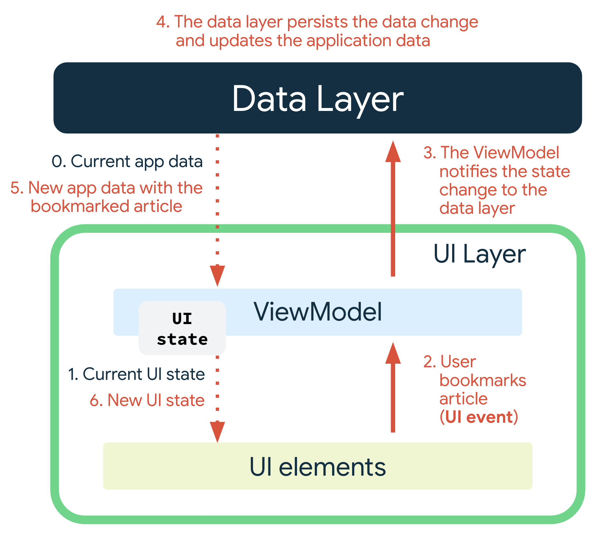

# View Model에서의 상태 관리 vs UI 단 상태 관리

[공식 문서](https://developer.android.com/topic/architecture/ui-layer?hl=ko)

## ViewModel
View Model은 state holder의 개념도 포함하고 있다        

화면 전반적으로 유지해야 하는 데이터를 view model에서 관리하게 된다

그리고 repository에서 데이터를 받아오고, UI로 보낼 데이터를 가공하는 것에도 사용한다

ViewModel을 활용할 때의 흐름은 다음과 같다      

사진을 보면, UI elements는 단순히 이벤트들을 트리거한다        
이 트리거한 이벤트를 기반으로 ViewModel은 Data Layer에 상태 변환을 전달한다        
Data Layer에서는 이 상태 변환을 감지하고, 상태를 변환한다      
ViewModel에서는 변화된 상태를 받아오고, UI는 ViewModel의 새롭게 변화된 상태를 받아서 그린다

> ViewModel은 생명주기가 Context보다 길기 때문에 Context, resources같은 것들을 참조하지 않도록 한다

UI 상태 객체는 서로 관련성 있는 상태를 처리해야 한다        
만약 관련 없는 상태가 있다면 분리하는 것이 좋고, 연관된 속성에 있어 파생 속성을 사용할 수도 있다

뷰는 diff 메커니즘이 존재하지 않는다
따라서 UI State가 커질수록, 필드 중 하나만 update했을 때 스트림이 내보내질 수 있다
이 때, View 전체가 업데이트된다

## UI
UI에서 처리할 상태는 생각보다 많지 않았다

dialog와 같이 일시적으로 유지하거나 앱 전반적으로 관리할 데이터가 아닌 경우에 활용하게 된다

## 결론
UDF 구조를 잘 활용하기 위해서는 ViewModel에 가능한 상태를 모두 정의하는 것이 좋겠다

단 일시적 혹은 굳이 알 필요 없는 정보들은 분리한다

UI는 단순히 uiState를 읽어오고, ViewModel은 상태를 관리한다.

ViewModel은 단일 flow를 사용하도록 하되, 만약 상태가 연관성이 없는 구조가 있다면 분리한다
(필요에 따라 다중 flow 구조가 될 수 있다)

View Model에서 연관성 있는 구조는 파생 속성을 활용하도록 한다