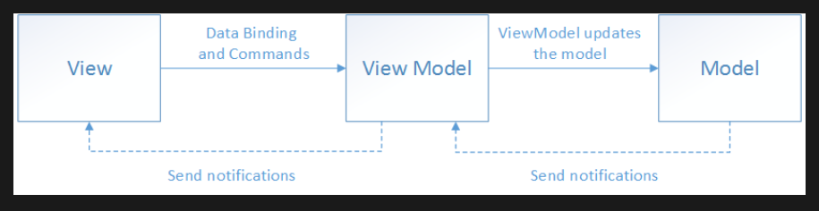

# MVVM 패턴

Model-View-ViewModel 패턴       
1. View에서 사용자와의 상호작용을 통해 이벤트를 감지 
2. ViewModel에 전달 
3. ViewModel은 이벤트를 기반으로 Model의 데이터 변경을 요청
4. Model은 ViewModel의 이벤트를 기반으로 데이터 변경
5. ViewModel은 변경된 Model의 데이터를 View에게 전달
6. View는 ViewModel에서 변경된 데이터를 UI에 반영하여 보여줌

## 특징
MVVM 패턴에서는 ViewModel은 View을 모르고, Model은 ViewModel을 모르도록 해야 한다       

ViewModel은 View를 모르게 한다라고 하는 것은 View를 직접 제어하지 못하도록 하고, Model 또한 ViewModel에 직접적인 영향을 주지 않도록 한다        
즉 Model에서 변경된 내용을 ViewModel이 자연스럽게 알도록 하고, ViewModel에서 변경된 데이터를 View에서 관측하여 자연스럽게 반영하도록 하는 것으로 이해했다       

여기서 DataBinding을 통해서 View 의 상호 작용을 ViewModel에 전달하고, ViewModel의 데이터 변경 사항에 대해서 View로 전달하는 구조를 설정할 수 있다

> MVVM 패턴을 대표적으로 보여주는 것이 DataBinding이긴 하지만 DataBinding을 직접적으로 사용하지 않더라도 코드를 통해 동일한 구조를 잡는다면 이 또한 MVVM 패턴이라고 할 수 있다