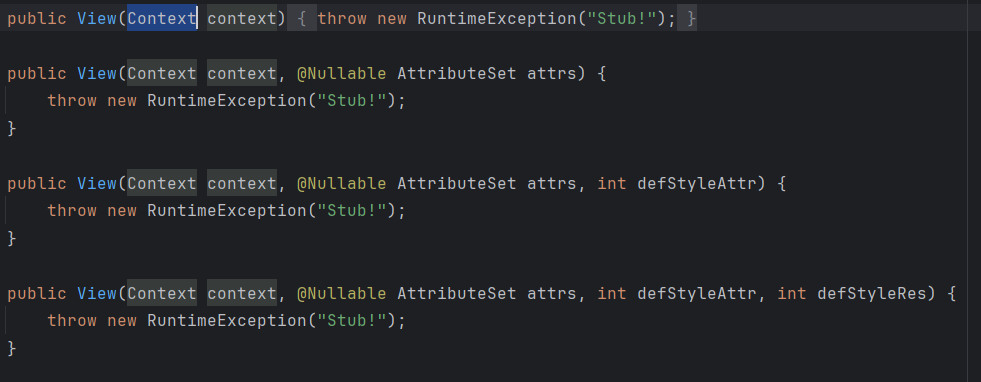
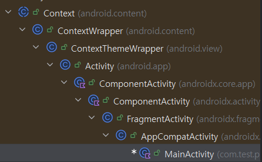

# Context
## View에서의 Context
  
일반적으로 Custom View를 구현한다고 하면 View를 상속 받아서 처리하게 된다  

View의 내부 코드를 확인해보면 생성자에 Context가 포함됨을 알 수 있다
  

이를 통해 각각의 View들 모두 Context를 주입받아서 처리하고 있음을 알 수 있다. View들은 객체로서 생성과 소멸이 명확하고, 이 때 사용할 외부 정보들을 처리하기 위해 Context를 소유하게 된다.

  
Activity는 Context를 상속받아서 구현되고, 해당 Activity에서 소유하는 View에 일반적으로는 Activity나 Fragment의 Context를 전달하여 처리하게 된다.

## Composable에서의 Context
Composable에서는 context를 소유하지 않고 공유된 Context에 접근하게 된다. Composable에서는 `CompositionLocal`을 일정 범위에 대한 공용 자원을 관리하는 데 `LocalContext` 또한 함께 관리된다. 그래서 해당 LocalContext를 통해 context를 소유하지 않고도 최신 Context에 접근이 가능하다

## 차이
XML에서는 View 하나 하나가 모두 객체로서 존재한다. 따라서 자체적으로 생성과 소멸이 존재하며, Context를 보유하게 된다.   
그에 비해 Compose에서 Composable은 객체가 아닌 함수다. 따라서 함수 결과로 인해 생성될 수 있는 결과들을 저장하고 보여주는 것이기 때문에 Composable마다 Context를 전달하여 처리하지 않는다.    
결과적으로 XML의 View는 각각의 View 모두 객체로서 존재하며, Context를 소유하고 있다. Compose의 Composable은 함수로 구성되며, 함수에 따라 생성되는 결과 값들을 저장하고 이를 보여주며 context를 소유하지 않고 범위 내의 공유되는 context 정보에 접근하여 처리하게 된다.