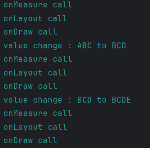
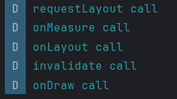
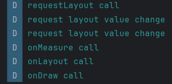
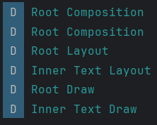
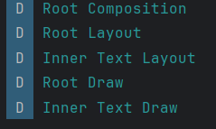
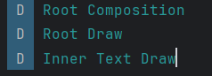
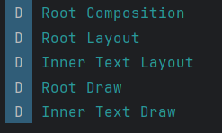

# View vs Composable 랜더링 과정
## XML의 View 생명주기
XML은 View를 그릴 때 3단계로 Measure -> Layout -> Draw 단계 순서로 그리게 된다.     
`Measure 단계`에서는 부모로부터 전달받은 `MeasureSpec`을 기반으로 자신의 크기를 결정하고, 그 제약을 자식에게 전달한다.       
`Layout 단계`에서는 자식의 좌표를 측정한다.        
`Draw 단계`에서는 픽셀을 그리는 명령을 실행하도록 한다.
> 단계를 보여줄 수 있는 Log를 보자

`invalidate()` 함수가 호출된다면 `Draw 단계`가 다시 호출된다. Draw 단계에서는 제약 조건과 좌표가 고정된 상태이므로, 내부 픽셀을 그리는 것만이 다시 실행되는 것이다.

`requestLayout()` 함수가 호출된다면 `Measure 단계`부터 다시 시작되며 결과적으로 제약 조건을 측정하는 것부터 픽셀을 그리는 것까지 전체 과정이 다시 실행된다. `requestLayout()`이 호출되었을 때 `Measure 단계`와 `Layout 단계`는 크기와 제약을 반드시 다시 측정해야 하므로 호출되지만 그려야 하는 내용의 차이를 확인하여 `Draw 단계`를 실행할 지 Skip할지 정한다.



로그를 확인하면 ABC에서 BCD로 값을 변경했을 때, BCD에서 BCDE로 변경했을 떄 각각 다시 그려야하는 내용이 다르기 때문에 Measure -> Layout -> Draw 단계가 재호출됨을 확인할 수 있다



이번 로그를 확인해보면 `requestLayout()` 호출 시 `Measure 단계`와 `Layout 단계`를 다시 실행하기는 했으나 어떤 값의 변경 없이 호출했기 때문에 `Draw 단계`가 생략됨을 알 수 있다. 그리고 `invalidate()` 호출 시에는 `Draw 단계`만 재호출 되는 것을 볼 수 있다.



이 과정은 `requestLayout()`을 호출하되 `requestLayout()` 함수를 override하여 값을 바뀌도록 설정했다. 여기서 로그를 확인해보면 값이 바뀌어 다시 `requestLayout()`이 한 번 더 호출되고 그 이후로 값이 변경되었기 때문에 `Draw 단계`를 넘어가지 못하고 새로 호출됨을 알 수 있다.

## Compose의 Composable 생명주기
Compose의 Composable은 그려질 때 Composition -> Layout -> Draw 단계 순서로 그리게 된다.     
`Composition 단계`에서는 자식들의 Tree 구조를 선언한다. 이 때 실질적으로 UI 객체는 존재하지 않는 상태이다.      
`Layout 단계`는 XML의 `Layout 단계`와 동일한 이름이지만 여기서는 크기와 위치에 대한 정보를 파악한다.        
`Draw 단계` 역시 XML의 `Draw 단계`와 동일한 이름으로 불리지만 GPU가 실행할 수 있도록 RenderNode에 그리기 명령을 기록하는 단계이다.

Composable이 가지는 상태 값이 변경되면 Recomposition이 발생하게 된다.       
Recomposition이 발생하면 변경되는 값에 따라서 특정 단계를 재실행하되, 불필요한 부분이 있다면 넘어갈 수 있다.        

## 실제 예시
각 예시를 간단하게 구현해서 확인해봤다. 구조는 string 값을 가지는 state와 color 값을 가지는 state를 호이스팅하여 관리했다.

```예시 구조
 └─ (string state & color state)
    └─ if (string.isEmpty)
       ├─ Content (Root)
       │   └─ Column (color update)
       │      ├─ Button
       │      ├─ Button
       │      ├─ Button
       │      ├─ Box (scale 변경)
       │      └─ Text   ← Inner Text
       └─ else
          └─ Content (Root)
              └─ Column (color update)
                 ├─ Button
                 ├─ Button
                 ├─ Button
                 ├─ Box (scale 변경)
                 └─ Text   ← Inner Text
```

**ex1)** Box 내에 flag 상태에 따라 존재 유무가 변경되는 Composable이 배치되어 있다면 이는 해당 상태에 따라 자식들의 Tree 구조가 변경된다. 이런 과정에서 전체 Tree가 다시 그려지는 것은 아니고 Tree 구조가 변경되는 일부 Composable만이 Composition 단계부터 재시작된다.     


**ex2)** Text에서 초기 값이 "ABC"에서 "BCD"로 변경된다면 상태값이 변경되었기 때문에 Recomposition이 발생한다. 해당 Text Composable이 가지는 위치는 변하지 않았고, 상태값이 변경되긴 했지만 길이가 동일하기에 크기 또한 변하지 않았다. 따라서 `Layout 단계`는 Skip 된다. 대신 값이 변경되어서 그려야하는 pixel 정보가 변경되었기 때문에 `Draw 단계`는 다시 실행된다.    
  

> ![CAUTION]
> 라고 예상 했으나 사실 Text의 경우 font나 글자에 따라 그려지는 세부 값들이 변경될 가능성이 있다. 따라서 `Layout 단계`를 넘어가는 것은 보장되지 않는다. 실제로 사진을 보면 `Layout 단계`를 넘기지 않고 다시 호출하는 것을 볼 수 있다. 물론 여기서 기존과 Layout의 크기, 위치가 동일하다면 계산까지 하고 다시 그리지 않고 넘어가게 되지만 계산은 하게 된다

**ex2-1)** 동일한 크기의 Layout에 버튼을 눌러서 색상만을 변경하고자 한다면 크기나 위치에 변동이 없고, 색상 값만 변경됨에 따라 `Layout 단계`가 계산조차 하지 않고 넘어가게 된다.    



ex3) Text에서 초기 값이 "ABC"에서 "ABCD"로 변경된다면 상태 값이 변경되어서 Recomposition이 발생한다. 해당 Text Composable이 가지는 위치는 변경되지 않았지만 Text의 값의 길이가 더 길어지면서 크기가 변경되었다. 따라서 `Layout 단계`는 다시 실행된다. 그리고 `Draw 단계` 역시 pixel이 변경되기에 다시 실행된다.
