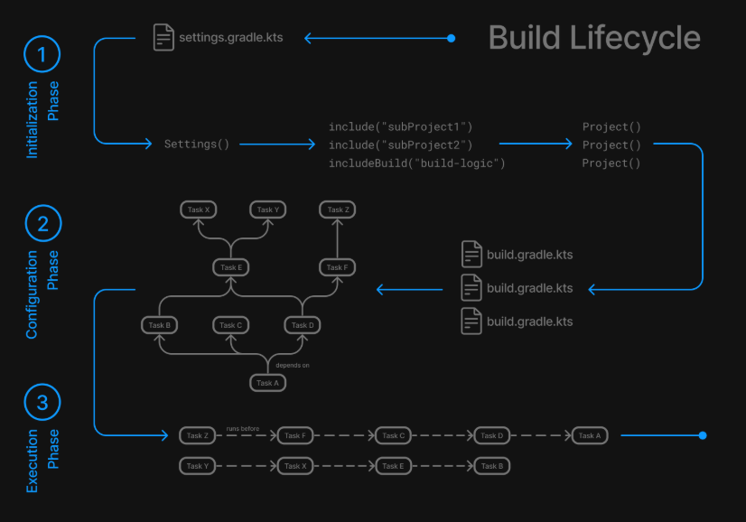
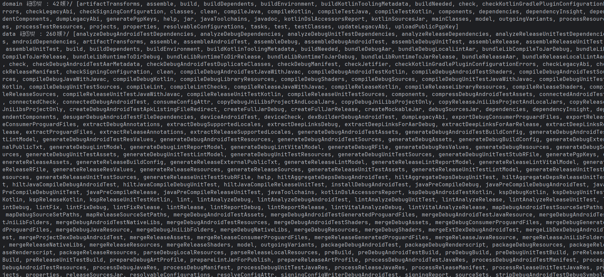

# Build 진행 과정
Android Studio를 사용하여 build를 할 경우 어떤 과정이 일어날까?

큰 틀로 보면 Initialization -> Configuration -> Execution 단계로 진행된다

## Initialization 단계
Initialization 단게는 말 그대로 초기화 단계이며, `settings.gradle`을 기반으로 프로젝트의 구조를 초기화 하는 단계입니다.  

build 이후 `settings.gradle` 파일을 읽고 `Settings` 객체를 생성합니다.  

.png>)

.png>)

`Settings` 객체는 프로젝트의 정보를 가지고 있는 객체입니다.

`Settings` 객체에는 root project를 포함한 하나 혹은 그 이상의 여러 `ProjectDescriptor` 객체를 가집니다. 

root project는 현재 project의 최상위 project이며, 그 하위에 sub project로써 여러 모듈들이 존재할 수 있습니다. app 모듈은 물론 추가되는 sub 모듈 또한 sub project에 속합니다.

> `Initialization` 단계에서는 실질적인 Project 객체가 생성되는 것은 아니고 `ProjectDescriptor`가 생성됩니다. 이 `ProjectDescriptor`란 `Project` 객체를 생성하기 위한 설계도로 트리 형태를 띕니다.

.png>)

> 사진을 확인해보면 root project의 children으로 app, domain, data, presentation 모듈들이 포함되어 있는 것을 확인할 수 있습니다.

## Configuration 단계
Initialization 단계에서 생성했던 `ProjectDescriptor`를 기반으로 `Project` 객체를 생성합니다. `Project` 객체는 각각의 `ProjectDescriptor`를 순회하면서 evaluate 직전에 생성됩니다.    
또한 `Project` 객체 마다 가지고 있는 `build.gradle` 파일을 기반으로 task 등록, 의존성 선언, Task Graph 생성 등의 작업을 진행하는 단계입니다.

> 각 Sub Project 별로 등록될 task의 개수를 볼 수 있음

Project 별로 task 등록을 진행합니다. `plugins { }` 블록 내에서 plugin을 추가할 경우 내부적으로 여러 task를 등록합니다.

외부 의존성이 필요한 경우 `dependencies{ }` 블록 내에서 선언하는 데, 이 또한 Configuration 단계에서 진행됩니다. 
> 선언은 해당 단계에서 이뤄지지만 실제로 다운로드/해석 되는 단계는 Execution 단계에서 지연 실행됩니다.

task graph는 task의 의존성에 따라 작업하는 순서를 정해주는 노선도입니다. 즉 어떤 task를 실행하기 전 미리 작업해야 하는 task들이 있을 수 있고, 이를 관리하기 위해 graph 형태로 생성되는 것입니다.

> build 명령 이후 `domain`모듈과 `data`모듈 내에서 진행될 task들의 목록을 print한 내역으로 여러 task들이 등록되어있는 것을 확인할 수 있습니다.

Configuration 단계 내에서 task들을 등록하고, 의존성 선언한 후에야 task graph가 그려지게 됩니다.

## Execution 단계
등록되었던 task graph를 기반으로 실제 실행하는 단계입니다.  
task graph 순서대로 각 task의 action이 실제로 실행됩니다.  
Configuration 단계에서는 단순히 task가 그래프에 배치된다면, Execution 단계에서는 실제로 task가 실행됩니다.