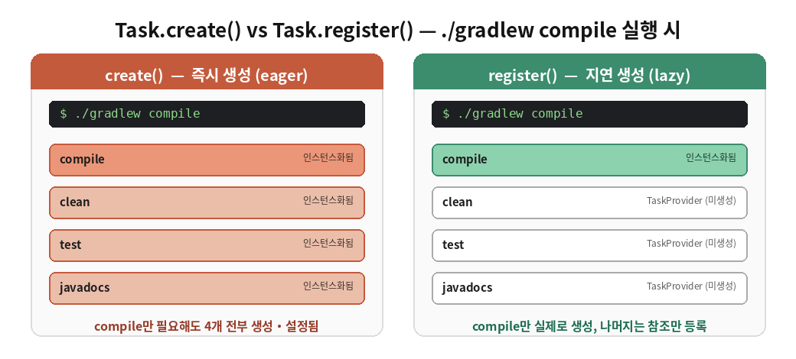

# Task 생성 함수

[참고 자료](https://docs.gradle.org/current/userguide/task_configuration_avoidance.html)

## Task.create()
기존 Gradle에서 Task를 등록할 때는 `create()`를 사용했었습니다.  
Task가 등록될 때 `create()`가 호출되면서 인스턴스화 됩니다.  
여기서 문제가 발생했던 것은 등록된 Task를 지금 사용하지 않아도 인스턴스화가 이뤄지기 때문에 build 시간에 많은 영향이 갔습니다.

## Task.register()
불필요한 인스턴스화 문제를 해결하기 위해 기존 `create()` 대신 `register()`를 사용하게 되었습니다.  
`register()`로 대체되면서 가장 큰 차이는 미리 인스턴스화 하는 것이 아니라 정보만 제공하고 실제 객체는 아닌 상태로, `Task 객체`가 아닌 `TaskProvider 객체`를 받게 됩니다.  

> [!NOTE]
> **Task**와 **TaskProvider**의 차이  
> - `Task 객체`는 정보들을 모두 가진 상태로 존재하는 객체를 말하는 것입니다.  
> - `TaskProvider 객체`는 이름과 타입 정도의 정보를 가지고 있습니다. 그러다 `TaskProvider.get()`이 실행된다면 그 때 모든 코드가 실행되며 객체가 생성됩니다.  
> 최종적으로 생성된 객체는 동일합니다.

kotlin의 lazy 키워드처럼 인스턴스화는 실제로 필요한 순간이 왔을 때에 진행됩니다.  
  
예를 들어, compile task를 진행하는 상황일 때, `create()`의 경우에는 `clean`, `javadocs`, `test` 등 불필요한 task들 또한 같이 생성됩니다.  
하지만 `register()`의 경우에는 끝까지 실체화되지 않습니다.

## 결과
  

`create()`에서 `register()`로 변경되면서 task들의 개수가 많고 실행되지 않는 task 비중이 큰 프로젝트일수록 시간이 많이 단축될 수 있습니다.