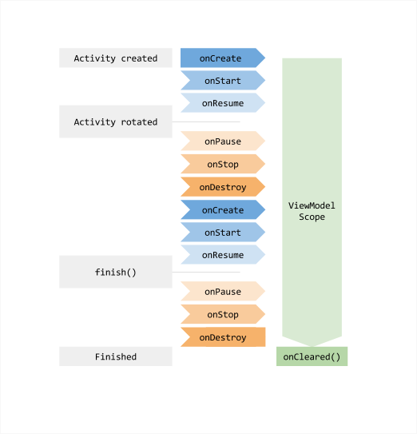

# ViewModel
ViewModel 클래스는 비즈니스 로직 혹은 화면 수준 상태 홀더이다       

UI에 상태를 노출하고 관련 비즈니스 로직을 캡슐화한다        

## 주요 이점
+ 상태를 캐시하여 구성 변경에도 이를 유지한다는 점
+ 활동 간 이동하거나 구성 변경을 따를 때 UI가 데이터를 다시 가져올 필요가 없다
+ 비즈니스 로직에 대한 액세스 권한을 제공한다

## 비즈니스 로직 엑세스
대부분의 비즈니스 로직이 데이터 레이어에 있지만 UI레이어에도 비즈니스 로직이 포함될 수 있다
화면 UI 상태를 만들기 위해 여러 저장소의 데이터를 결합하거나 특정 유형의 데이터에 데이터 레이어가 필요하지 않은 경우를 예로 들 수 있다

ViewModel은 UI 레이어의 비즈니스 로직을 처리하기에 적합한 위치다        
또한 ViewModel은 UI레이어의 비즈니스 로직을 처리하기에 적합한 위치이다      
또한 ViewModel은 이벤트를 처리하고, 애플리케이션 데이터를 수정하기 위해 비즈니스 로직을 적용해야 할 때 이를 계층 구조의 다른 레이어에 위임하는 역할을 한다

## ViewModel 종속 항목 삭제
ViewModel은 수명 주기 과정에서 `ViewModelStoreOwner`에 의해 ViewModel이 소멸될 때 `onCleared` 메소드를 호출한다     
이렇게 하면 ViewModel의 수명 주기를 따르는 모든 작업 혹은 종속 항목을 정리할 수 있다        

`viewModelScope`는 ViewModel의 수명 주기를 자동으로 따르는 내장 `CoroutineScope`이다.       
ViewModel은 이를 사용해 비즈니스 관련 작업을 트리거한다.     
`viewModelScope` 대신 맞춤 범위를 사용하려면 ViewModel은 `CoroutineScope`를 생성자의 종속 항목으로 수신하면 된다

`ViewModelStoreOwner`가 ViewModel 삭제하면 ViewModel도 `CoroutineScope`를 취소한다

## ViewModel 생명주기
`ViewModel`은 범위로 지정된 `ViewModelStoreOwner`가 사라질 때 메모리가 남아있다     

활동의 경우가 완료될 때     
Fragment의 경우 분리될 때       
탐색 항목의 경우 백 스택에서 삭제될 때



해당 다이어그램을 보면 Configuration Change에서도 ViewModel이 살아남는 것을 확인할 수 있다

또한 ViewModelScope가 해당 Activity가 finish가 호출되고 Finished 상태로 들어서면 onCleared()가 호출되면서 삭제되는 것을 알 수 있다

## 권장사항
### 재사용 가능한 컴포넌트에서 ViewModel을 호출하지 말고 화면 단위로 사용해라
예를 들어 현재 Study Mate라는 프로젝트에서 PlanItem 컴포넌트를 사용하고 있다
이 PlanItem에서 ViewModel을 호출하지 마라! 라는 것

ViewModel은 UI 화면 단위에서 상태를 보존하고 관리하기 위해 설계된 것이다 (Activity, Fragment, Compose의 Navigation Destination)

### ViewModel은 UI 구현 세부 사항을 알 수 없으므로, 노출하는 메서드의 이름과 UI 상태 필드에 대해 일반적으로 유지해라! (재사용성이 올라간다)

### `ViewModelStoreOwner`보다 오래 지속될 수 있으므로 수명 주기 관련 API의 참조를 보유하면 안된다 (Context)
혹은 Resources를 호출해 메모리 누수를 방지한다

**Why?**        
ViewModel에 Activity 혹은 Fragment의 Context를 전달했다고 하자      
ViewModel은 해당 Context보다 긴 생명주기를 가지게 된다      
ViewModel이 특정 Activity의 Context를 멤버로 가진다면, Activity는 destory되었지만 ViewModel이 Context를 잡고 있기 때문에 GC되지 않게 됨 >> 이로인해 메모리 누수가 발생

**마스터 클래스의 대답도 여기에 있다**      
저번 마클에서 ViewModel 내에서 Resource 관리는 어떻게 해야할까? 라는 질문에 Context를 건네주면 되지 않을까? 했다        
하지만 위에서 말했듯 메모리 누수의 위험이 있기에 이는 좋은 방법이 아니다.       
그렇다면? UI 계층에서 받아와 ViewModel로 전달하는 방식을 권장한다       
```kotlin
val res = context.resources
```

### ViewModel 자체를 더 작은 UI 컴포넌트 혹은 일반 함수, 다른 클래스로 전달하지 않기
이와 같이 할 경우, 캡슐화가 깨질 수 있고, 결합도가 증가한다     
그리고 수명 주기에 혼란이 오게 된다