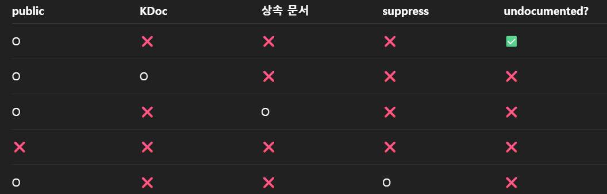
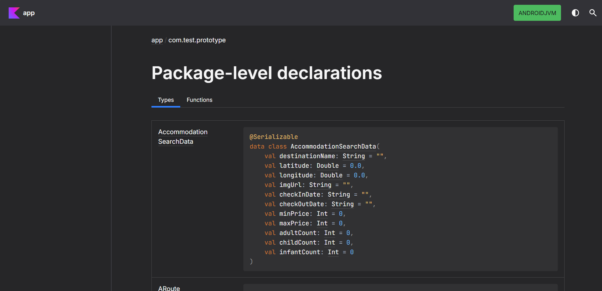

# MustBeDocumented 어노테이션
Generated Documentation에 해당 Annotation도 포함될 수 있는지를 나타낸다         
주로 Library를 만들 때 사용한다

이를 사용할 때 kotlin 공식 문서에 있는 `dokka`를 사용하면 공식 문서를 자동으로 만들 수 있다

## dokka
문서 생성을 위한 라이브러리 안드로이드 제공 라이브러리다

`dokka` 2.1.0 버전을 통해서 구현할 수 있다      
dokka 의존성 설정이 모두 종료되고 나면, 사용할 모듈의 `gradle.kts`에서 설정할 수 있다       

```kotlin
dokka {
    dokkaSourceSets {
        named("main") {
            reportUndocumented.set(true)
        }
    }
    dokkaPublications {
        html {
            outputDirectory.set(layout.buildDirectory.dir("dokka/html"))
        }
    }
}
```     
이렇게 기본 설정이 가능하다     

`dokkaSourceSets`의 범위는 문서화 대상, 문서화 규칙, 경고/에러 정책을 정하는 부분이다. 그 중에서 `named("main")`의 경우에 `src/main/` 위치를 가리키는 것이다.

이 때 `reportUndocumented.set(true)`는 documented되지 않은 문서에 대해서 report를 제공하라는 옵션 설정이다      

`dokkaPublications` 블록의 경우에는 html로 문서를 생성한다는 것이고, `outputDirectory`를 통해서 output 결과를 어디에 저장할 지를 지정할 수 있다

이후에 `./gradlew dokkaGenerate`라는 명령어를 통해서 json과 html을 생성시킬 수 있다

**Dokka의 의미**

`dokkaSourceSets`에서 설정했던 `reportUndocumented`의 조건은 



위의 표와 동일하다


Dokka는 공개된 문서들 중에서 문서화가 되지 않은 것들을 문제 삼기로 한 것이다        

따라서 Public이고 공개 API이며 상속된 문서가 없다면 문제가 되는 것이다      

결과적으로 private한 클래스 혹은 function이거나 상속된 문서가 있다면 문제가 되지 않는다

## 실행 결과

위 사진과 같이 문서를 생성해주며, 확인해보면 type과 function으로 분리하여 만들어준다