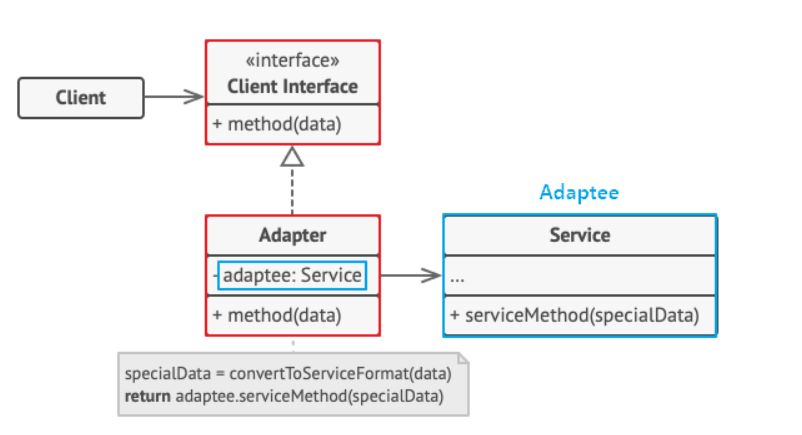
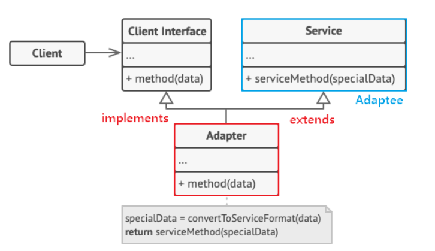

# Adapter 패턴
호환성이 없는 인터페이스 때문에 함께 동작할 수 없는 클래스들을 함께 동작하도록 변환 역할을 하는 패턴

> 예를 들면 기존 시스템에 새로운 서드파티 라이브러리를 추가하기와 같은 경우

호환성 및 신규 기능 확장을 할 수 있다

Adapter를 구성하는 방식은 2가지가 있다

## 객체 어댑터 (Object Adapter)
+ 합성된 멤버에게 위임을 이용한 Adapter 패턴
+ 자기가 해야 할 일을 클래스 멤버 객체의 메소드에게 다시 시킴으로써 목적을 달성하는 것을 위임이라 함
+ 합성을 활용하기 때문에 런타임 중 Adpatee(Service)가 결정되어 유연하다
+ Adaptee(Service) 객체를 필드 변수로 저장해야 하므로 공간 차이 비용이 든다

구조는 이렇게 되어 있다     
**1 Adaptee(Service)** : 어댑터 대상 객체. 기존 시스템 / 외부 시스템 / 써드파티 라이브러리      
**2 Target(Client Interface)** : Adapter가 구현하는 인터페이스      
**3 Adapter** : Client와 Adaptee 중간에서 호환성이 없는 둘을 연결하는 역할
**4 Client** : 기존 시스템을 어댑터를 통해 이용하는 쪽

RecyclerView도 객체 어댑터 패턴을 따른다            
위의 구성 요소를 확인해보자
Adaptee는 ViewHolder가 되고, Target은 RecyclerView가 된다       

RecyclerView는 Adapter를 소유하고, Adapter는 내부에 ViewHolder에 대한 작업을 처리하게 된다      
따라서 RecyclerView는 데이터나 View Holder를 직접 조작하지 않고 동작을 Adapter에게 위임한다

## 클래스 어댑터 (Class Adapter)
+ 클래스 상속을 이용한 어댑터 패턴
+ Adaptee를 상속했기 때문에 따로 객체 구현없이 바로 코드 재사용이 가능하다      
+ 자바에서는 다중 상속 불가 문제가 있어 권장하지 않는 방식이다 (코틀린에서도 다중 상속은 불가능하여 사용하지 않을 것 같다)

이런 구조도를 가지며 객체 어댑터와의 차이점은 상속을 이용해 구성한다는 것이다

써있는 것처럼 Target은 implements하고, Adaptee(Service)는 extens하여 사용하는 방식이다

## 장점
+ 프로그램의 기본 비즈니스 로직에서 인터페이스 혹은 데이터 변환 코드를 분리할 수 있다 >> SRP를 만족한다
+ 기본 클래스 코드를 건들지 않고 클라이언트 인터페이스를 통해 어댑터와 작동하기 떄문에 OCP 또한 만족한다

## 단점
+ 새로운 Interface와 어댑터 클래스를 세트로 구성해야 하므로 코드의 복잡성을 증가한다