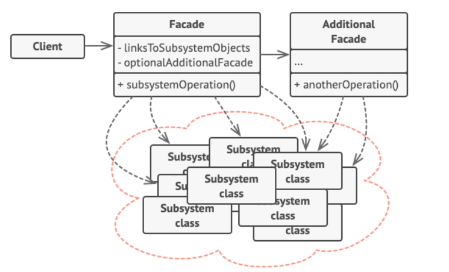

# 파사드 패턴 (Facade Pattern)
사용하기 복잡한 클래스 라이브러리에 대해 사용하기 편하게 간편한 API를 구성하기 위한 구조 패턴이다

프로그램을 개발하다보면 클래스들이 결합도가 높아지는 경우가 있다        
이럴 때 이 처리들을 개별적으로 제어하는 것이 아니라 제어하기 쉽도록 집약적 행위들을 창구가 알아서 처리해 결과를 준다

이처럼 Facade 패턴은 복잡하게 얽혀 있는 것을 정리해서 사용하기 편한 인터페이스를 고객에서 제공한다고 보면된다

1. Facade
서브시스템 기능을 편리하게 사용할 수 있도록 하기 위해 여러 시스템과 상호 작용하는 복잡한 로직을 재정리해서 높은 레벨의 인터페이스를 구성한다        
Facade 역할은 서브 시스템의 많은 역할에 대해 '단순 창구' 역할을 한다        
클라이언트와 서브시스템이 서로 긴밀하게 연결되지 않도록 조심해야 함

2. Additional Facade
파사드 클래스는 여러 개 존재할 수 있다      
연관되지 않은 기능이 존재한다면 얼마든지 Facade 2세로 분리      
2세 Facade는 사용할 수도 있고 클라이언트에서 직접 접근하는 것 또한 가능하다

3. SubSystem
수십 가지 라이브러리 혹은 클래스들

4. Client
서브 시스템에 직접 접근하는 대신 Facade를 이용

다른 디자인 패턴들과는 다르게 클래스 구조가 정형화되지 않았다

**집약화**해주는 것 자체가 디자인 패턴이 되는 셈

결과적으로 객체 지향 프로그래밍 관점으로 치환한 것이 Facade 패턴이다

## 사용 시기
+ 시스템이 너무 복잡할 때
+ Interface를 활용해 복잡한 시스템의 접근을 간소화하고자 할 때
+ 시스템을 사용하고 있는 외부와 결합도가 너무 높을 때 의존성을 낮추기 위함

## 장점
+ 하위 시스템의 복잡성에서 코드를 분리하여, 외부에서 시스템을 사용하기 쉬워진다
+ 하위 시스템 간의 의존 관계가 많을 경우 이를 감소시키고 의존성을 한 곳으로 모을 수 있다
+ 복잡한 코드를 숨기는 것으로, 클라이언트가 코드를 몰라도 Facade 클래스만 이해하여 사용이 가능하다

## 단점
+ Facade가 앱의 모든 클래스에 결합된 GOD 객체가 될 수 있다
+ 파사드 클래스 자체가 서브 시스템에 대한 의존성을 가지게 되어 의존성을 완전히 피할수는 없다
+ 코드 자체는 늘어남으로 유지 보수 측면에서 공수가 더 많이 들 수 있다

## 결과
추상화하고자 하는 시스템이 얼마나 복잡한지 Facade 패턴 적용을 통한 이점과 유지보수 비용을 적절히 비교해서 사용해야 함

> 이거 어찌 보면 이상적인 ViewModel의 역할이지 않을까?
> UI는 ViewModel 내부 동작은 모르고 기능만을 사용하는 것처럼 사용한다는 부분에서 Facade 패턴과 유사하다고 생각이 들었다. 다만 ViewModel은 추가적으로 상태 관리를 포함한다.

[참고 자료](https://inpa.tistory.com/entry/GOF-%F0%9F%92%A0-%ED%8D%BC%EC%82%AC%EB%93%9CFacade-%ED%8C%A8%ED%84%B4-%EC%A0%9C%EB%8C%80%EB%A1%9C-%EB%B0%B0%EC%9B%8C%EB%B3%B4%EC%9E%90)