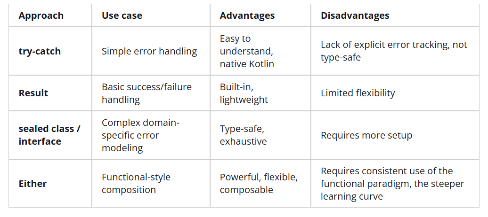

# 예외 처리 방식
Kotlin에서는 Java랑 다르게 모든 exception을 `unchecked`로 처리한다.     
따라서 function signature를 선언해 줄 필요가 없다

[참고 블로그](https://softwaremill.com/handling-errors-in-kotlin/)

## Error 처리 방식
### try-catch
Java의 방식, 가장 친숙하고 간단한 방식

**try**블록에 exception을 던질만한 코드를 넣고, exception 발생 시 **catch**블록으로 넘어가 해당 코드르 실행     
선택적으로 **finally**블록을 사용할 수 있음     
**finally**블록의 경우 try, catch 이후에 모든 resource들을 정리할 때 사용하곤 함

* 장점 : 직관적, 쉬움
* 단점 : Error Tracking이 부족함
> 실수 가능성이 존재하고, 복잡한 상황에서 다루지 않은 오류가 발생할 수 있음

### Result
try-catch 방법 보다 현대적이고 관용적인 방식        

성공에 대한 결과를 Success, 예외에 대한 처리를 Failure로 Wrapping하는 방식

* 장점 : success, failure가 분리되어 test 혹은 debugging이 수월하며, 가독성이 좋다 / 가볍고 간단한 연산에서는 완벽에 가까움
* 단점 : 복잡한 상황을 다루는 것에 한계가 있으며, 많은 데이터로 도메인 별 오류를 모델링하거나 애플리케이션에서 여러 미묘한 오류 사례를 처리할 때 부족한 측면이 있음

### Sealed Class or Sealed Interface
상속할 수 있는 하위 클래스의 집합을 제한하는 클래스     
Result는 일반적으로 사용할 수 있으나, 목적에 따라 도메인에 특화된 모델을 생성하거나 등등을 할 때 별도의 모델링이 가능하다       

Kotlin 컴파일러가 모든 경우를 빠짐없이 처리하도록 제한할 수 있다

when을 같이 사용하는 것이 좋다
> kotlin 컴파일러가 알아서 체크를 해주기 때문에

* 장점 : 가독성(when 분기로 인해 가독성 증가) / 확장성 (when문에 조건을 추가하는 것으로 확장 가능) / 유지 보수성

### Either
외부 라이브러리 (Array.kt) 사용     
결과가 성공 혹은 실패 두 가지로 구분되는 상황에 적합하도록 설계됨       

조금 더 체이닝 등 kotlin과 함수형 프로그래밍에 적합한 방식

## 결론

* try-catch : 빠름, 직관적, 스크립트나 작은 일에서 좋음
* Result : 간단한 성공, 실패 연산에 적합 / 별도의 복잡한 오류 모델링이 필요없을 때
* Sealed class : 여러 domain 모델들이 필요하며, 각각 처리가 필요할 때
* Either : 함수형 패러다임을 적용할 때 / 체이닝 연산이나 복잡한 워크플로우를 처리할 때